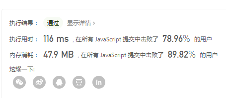

## 困难难度

1. 滑动窗口最大值

>给定一个数组 nums，有一个大小为 k 的滑动窗口从数组的最左侧移动到数组的最右侧。你只可以看到在滑动窗口内的 k 个数字。滑动窗口每次只向右移动一位。

返回滑动窗口中的最大值。

示例:
```
输入: nums = [1,3,-1,-3,5,3,6,7], 和 k = 3
输出: [3,3,5,5,6,7] 
解释: 

  滑动窗口的位置                最大值
---------------               -----
[1  3  -1] -3  5  3  6  7       3
 1 [3  -1  -3] 5  3  6  7       3
 1  3 [-1  -3  5] 3  6  7       5
 1  3  -1 [-3  5  3] 6  7       5
 1  3  -1  -3 [5  3  6] 7       6
 1  3  -1  -3  5 [3  6  7]      7
```

**思路1：直接按照定义做就好，暴力解法**

```javascript
var maxSlidingWindow = function(nums, k) {
	let res = [];

	if (!nums.length) return res;

	for(let i=0;i<=nums.length-k;i++) {
		let arr = nums.slice(i, i+k);
		res.push(Math.max(...arr));
	};
	return res;
};
```
----


**思路2：单调队列解法，以[1,3,-1,-3,5,3,6,7]为例，k为3，构建一个队列，保持队头为当前滑动窗口的最大值，一直排列下去，首先开始循环，队列为空，第一个元素为1，进队列，队头为1，但还没满足窗口长度为3的条件，继续遍历，下一个为3，比1大，因此清空队列，队头为3，下一个为-1，比3小，进队列，队列为3,-1，满足k为3的条件，res第一个数为3，然后到-3，比队头3小，因此res为[3,3]，继续遍历到5，此时3被踢出，队头为-1，比5小，清空队列，队头为5，res为[3,3,5]，继续遍历到3，比5小，进队列，res为[3,3,5,5],继续遍历到6，比队头5大，清空队列，队头为6，res为[3,3,5,5,6],下一个数为7，比6大，清空队列，队头为7，res为[3,3,5,5,6，7]**

```javascript
var maxSlidingWindow = function(nums, k) {
	let list = [];
	let res = [];
	if (!nums.length) return res;
	for(let i=0;i<nums.length;i++) {
		if (i - list[0] > k-1) {
			list.shift();
		};
		if (!list.length) {
			list.push(i);
		}else if (nums[i] > nums[list[0]]) {
			list = [i];
		}else {
			while(list.length && nums[list[list.length-1]] < nums[i] ) {
				list.pop();
			};
			list.push(i);
		}
		if (i >= k-1) {
			res.push(nums[list[0]]);
		};
	};
	return res;
};
```
----


2. 最小覆盖子串

>给你一个字符串 s 、一个字符串 t 。返回 s 中涵盖 t 所有字符的最小子串。如果 s 中不存在涵盖 t 所有字符的子串，则返回空字符串 "" 。

注意：如果 s 中存在这样的子串，我们保证它是唯一的答案。

示例 1：
```
输入：s = "ADOBECODEBANC", t = "ABC"
输出："BANC"
示例 2：

输入：s = "a", t = "a"
输出："a"
```
提示：

1 <= s.length, t.length <= 105
s 和 t 由英文字母组成

**思路：滑动窗口思想，先定义一个对象needs记录目标串各字符出现次数，定义两个指针，右指针先移动，并用一个对象windows记录字符出现次数，当widnows和needs相匹配时，证明该子串包含目标子串，此时移动左指针，并继续检验两个对象，直到两个对象不匹配后，停止左指针移动，并记录当前子串长度，继续移动右指针直到两个对象相匹配，重复以上步骤，并得出最短子串**

```javascript
var minWindow = function(s, t) {
    let res = '';
    let needs = {};
    let windows = {};
    let right = 0;
    let left = 0;
    let size = t.length;
    let vaild = 0;
    let min = Number.MAX_SAFE_INTEGER;
    for(let text of t) {
        needs[text] ? needs[text]++ : needs[text] = 1;
    }
    while(right < s.length) {
        const rights = s[right];
        if (needs[rights]) {
            windows[rights] ? windows[rights]++ : windows[rights] = 1;
            if (windows[rights] === needs[rights]) vaild += needs[rights];
		}
        if (vaild === size) {
            while(left <= right) {
                const lefts = s[left];
                const len = right - left;
                if (needs[lefts]) windows[lefts]--;
                if (windows[lefts] < needs[lefts]) {
                    if (len < min) {
                        min = len;
                        res = s.slice(left, right + 1);
                    }
					vaild -= needs[lefts];
					left++;
                    break;
                }
				left++;
            }
        }
        right++;
    }
    return res.length ? res : '';
};
```
----


3. 买卖股票的最佳时机 III

>给定一个数组，它的第 i 个元素是一支给定的股票在第 i 天的价格。

设计一个算法来计算你所能获取的最大利润。你最多可以完成 两笔 交易。

注意: 你不能同时参与多笔交易（你必须在再次购买前出售掉之前的股票）。

示例 1:
```
输入: [3,3,5,0,0,3,1,4]
输出: 6
解释: 在第 4 天（股票价格 = 0）的时候买入，在第 6 天（股票价格 = 3）的时候卖出，这笔交易所能获得利润 = 3-0 = 3 。
     随后，在第 7 天（股票价格 = 1）的时候买入，在第 8 天 （股票价格 = 4）的时候卖出，这笔交易所能获得利润 = 4-1 = 3 。
```

示例 2:
```
输入: [1,2,3,4,5]
输出: 4
解释: 在第 1 天（股票价格 = 1）的时候买入，在第 5 天 （股票价格 = 5）的时候卖出, 这笔交易所能获得利润 = 5-1 = 4 。   
     注意你不能在第 1 天和第 2 天接连购买股票，之后再将它们卖出。   
     因为这样属于同时参与了多笔交易，你必须在再次购买前出售掉之前的股票。
```

示例 3:
```
输入: [7,6,4,3,1] 
输出: 0 
解释: 在这个情况下, 没有交易完成, 所以最大利润为 0。
```
**思路：动态规划，直接套框架**

```javascript
var maxProfit = function(prices) {
	let no_1 = 0;
	let no_2 = 0;
	let has_1 = -prices[0];
	let has_2 = -prices[0];
	for(let i = 1; i < prices.length; i++) {
		no_2 = Math.max(no_2, has_2 + prices[i]);
		has_2 = Math.max(has_2, no_1 - prices[i]);
		no_1 = Math.max(no_1, has_1 + prices[i]);
		has_1 = Math.max(has_1, -prices[i]);
	}
 	return no_2;
};
```
----


