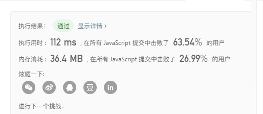

## 字符串

1. 请实现一个函数，把字符串中的每个空格替换成"%20"。
例如输入“We are happy”，则输出“We%20are%20happy.”。
```javascript
/*
* 三种解题方法
* 1.正则;
* 2.利用join和split方法;
* 3.for循环配合split方法;
*/

// 正则

let str = "We are happy";

function replace(str) {
    let re = /\s/g;
    let newStr = str.replace(re,'%20');
    return newStr;
};

// 利用join和split方法
function replace2(str) {
    let arr = str.split(" ");
    let newStr = arr.join('%2%');
    return newStr;
}

// for循环配合split方法
function replace3(str) {
    let newStr='',lastIndex = 0,j = 0;
    for(let i=0;i<str.length;i++) {
        if(str[i] === " ") {
            let str1 = str.substring(j, i);
            j = lastIndex = i+1;
            str1 += "%2%";
            newStr += str1;
        }
    };
    newStr += str.substring(lastIndex,str.length);
    return newStr;
}
```

2. 输入一个字符串，打印出该字符串中字符的所有排列。例如输入字符串 abc，则打印出由字符 a、b、c 所能排列出来的所有字符串 abc、acb、bac、bca、cab 和 cba。
```javascript
/**
* 解题思路：以字符串abc为例
* 先得出正常排列，即把a、b、c依次取出然后跟子串结合，得出abc,bac,cab;
* 然后把子串作为新一轮字符串进行递归，然后去除重复值，得出所有排列;
* 例如把a提取出来后，子串为bc,bc递归得出排列为bc、cb，然后再和a结合，得出abc、acb,以此类推得出剩余排列;
*/

// 自己的解法（比较简陋，应该有很大的优化空间）
function replace(arr, obj) {
    if( arr.length <= 1 ) {
        return arr;
    };
    let result = [];
    for(let i=0;i<arr.length;i++) {
        let temp = Object.assign([], arr);
        let first = temp.splice(i,1);
        let sm = replace(temp, obj);
        for(let j=0;j<sm.length;j++) {
            let str = [...first,...sm[j]].join("");
            if(!obj[str]) {
                obj[str] = 1;
                result.push(str);
            }
        }
    };
    return result;
};

function perm(str) {
    let strArr = str.split("");
    let obj = {} // 用来去重
    let arr = replace(strArr, obj);
    return arr;
}

let str = 'abb';
console.log(perm(str));
```

3. 输入一个英文句子，翻转句子中单词的顺序，但单词内字符的顺序不变，标点符号和普通字母一样处理。例如输入字符串"I am a student."，则输出"student. a am I"。
```javascript
/*
* 两种解法:
* 1.利用split方法，以空格为分隔符，转为数组后调用reverse方法，最后用join方法转为字符串结果
* 2.利用数组pop和push方法模拟栈后进先出的特性, 以空格为分割条件，进行翻转
*
*/
let str = 'I am a student.';

// 方法一
function reverse1(str) {
    let reverseStr = str.split(' ').reverse();
    return reverseStr.join(" ");
};

// 方法二
function reverse(str) {
    let stack = [],
        len = str.length,
        lastStr = '';
        newStr = '';
    for(let i=0; i<len; i++ ) {
        if( str[i] === ' ') {   //遇到空格后判断为一个完整的字符
            stack.push(lastStr);    // 压栈
            lastStr = '';           // 清空字符，重新获取下个字符
            continue;               // 跳出循环
        }else if (i === len-1) {    // 结尾处也要做判断处理，把最后一个字符压入栈
            lastStr += str[i];
            stack.push(lastStr);
        };
        lastStr += str[i];  // 记录一个完整字符
    };
    while( stack.length ) {     // 出栈重新组合翻转后的新字符串
        let first = stack[0];
        let currentStr = stack.pop();
        if( currentStr != first ) {
            currentStr+= ' ';   // 用空格分隔
        }
        newStr += currentStr;
    };

    return newStr;
};

```

4. [leetcode原题](https://leetcode-cn.com/problems/string-to-integer-atoi)请你来实现一个 atoi 函数使其能将字符串转换成整数。

首先，该函数会根据需要丢弃无用的开头空格字符，直到寻找到第一个非空格的字符为止。

当我们寻找到的第一个非空字符为正或者负号时，则将该符号与之后面尽可能多的连续数字组合起来，作为该整数的正负号；假如第一个非空字符是数字，则直接将其与之后连续的数字字符组合起来，形成整数。

该字符串除了有效的整数部分之后也可能会存在多余的字符，这些字符可以被忽略，它们对于函数不应该造成影响。

注意：假如该字符串中的第一个非空格字符不是一个有效整数字符、字符串为空或字符串仅包含空白字符时，则你的函数不需要进行转换。

在任何情况下，若函数不能进行有效的转换时，请返回 0。

说明：

假设我们的环境只能存储 32 位大小的有符号整数，那么其数值范围为 [−231,  231 − 1]。如果数值超过这个范围，qing返回  INT_MAX (231 − 1) 或 INT_MIN (−231) 。

示例 1:

输入: "42"
输出: 42
示例 2:

输入: "   -42"
输出: -42
解释: 第一个非空白字符为 '-', 它是一个负号。
     我们尽可能将负号与后面所有连续出现的数字组合起来，最后得到 -42 。
示例 3:

输入: "4193 with words"
输出: 4193
解释: 转换截止于数字 '3' ，因为它的下一个字符不为数字。
示例 4:

输入: "words and 987"
输出: 0
解释: 第一个非空字符是 'w', 但它不是数字或正、负号。
     因此无法执行有效的转换。
示例 5:

输入: "-91283472332"
输出: -2147483648
解释: 数字 "-91283472332" 超过 32 位有符号整数范围。 
     因此返回 INT_MIN (−231) 。

```javascript
function isMax(value) {
    let max_value = Math.pow(2,31);
    if( value<0 && value < -max_value ) {
        return -max_value;
    };
    return value> max_value-1?max_value-1:value;
}

function isSign(str) {
    return str === '-' || str === '+';
};

function isNumber(str) {
    let re = /\d/;
    return re.test(str);
}

function atoi(str) {
    let trimStr = str.trim();
    let def = 0;
    if(!trimStr.length)return def;
    let number = '';
    for(let i=0;i<trimStr.length;i++) {
        let value = trimStr[i];
        if( i === 0 ) {
            if(isSign(value) || isNumber(value)) {
                number += value;
            }else {
                return def;
            }
        }else {
            if( isNumber(value) ){
                number += value;
            }else {
                break;
            }
        }
    };
    return isMax(+number) || 0;
};
```
>leetcode结果(一般般吧o(╯□╰)o往后会继续优化)
