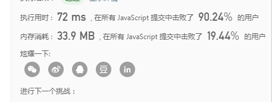

## 查找

1. 把一个数组最开始的若干个元素搬到数组的末尾，我们称之为数组的旋转。
输入一个递增排序的数组的一个旋转，输出旋转数组的最小元素。例如数组{3,4,5,1,2}为{1,2,3,4,5}的一个旋转，该数组的最小值为 1。
```javascript
/*
* 思路：用二分法查找，先查出中间的数，如果中间的数大于最左边的数，那么中间的数在原数组，如果
* 中间的数小于最右边的数，那么中间的数在旋转数组，依次二分查找找出最小值
* 特殊数组类似[2,3,1,2,2,2,2]这种，最左边最右边和中间的数都相同，就用最普通的查找最小值
*/
function findMin(arr){
	var num = arr[0];
	for(var i=1;i<arr.length;i++){
		if( arr[i]<num ){
			num = arr[i]
		}
	}
	return num;
}

function searchMin(arr) {
	let upper = arr.length-1,
			lower = 0;

	while(lower<=upper) {
		let pivot = Math.floor(lower + (upper - lower) / 2);
		let min = arr[pivot];

		if(arr[pivot - 1] > min ) {
			return min;
		};

		if(min <= arr[upper]) {
			upper = pivot - 1;
		}else if(min >= arr[lower]) {
			lower = pivot + 1;
		};
	};

  return arr[0];
};

```


2. 统计一个数字在排序数组中出现的次数。
```javascript
/*
* 用二分法，找到指定数字的左右边界，然后相减得出值
* 
*/
function bindSearch(arr, target, mode) {
	let lower = 0,
			upper = arr.length-1;

	while(lower <= upper) {
		let min = Math.floor(lower+(upper-lower)/2);
		let pivot = arr[min];
		if( target > pivot ) {
			lower = min+1;
		}else if( target < pivot ) {
			upper = min -1;
		}else {
			if( mode === 'left' ) {
				if( min === 0 || arr[min - 1] != target ) {
					return min;
				};
				upper = min - 1;
			}else {
				if( min === arr.length - 1 || arr[min+1] != target ) {
					return min+1;
				};
				lower = min + 1;
			};
		};
	};
	
	return -1;
};

function findMany(arr,target) {
	let right = bindSearch(arr,target,'right');
	let left = bindSearch(arr,target,'left');

	return right - left;
}

console.log(findMany([1,2,3,3,4,5],3));
```